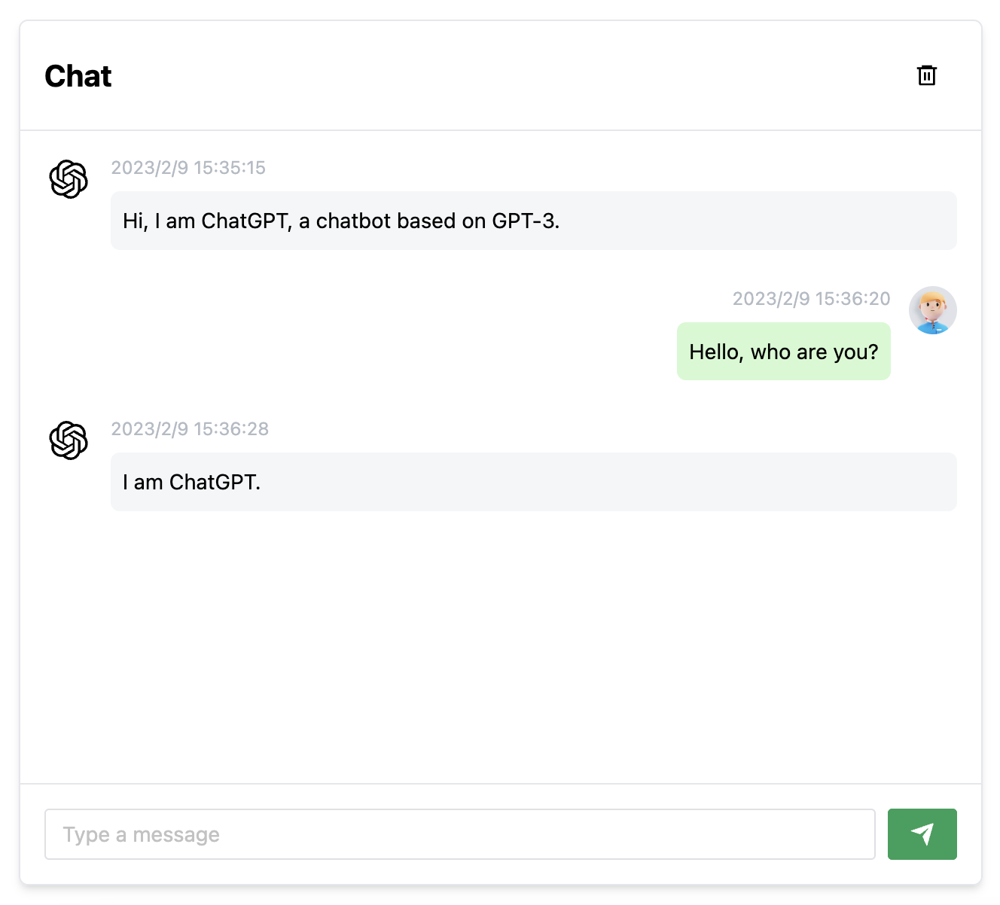
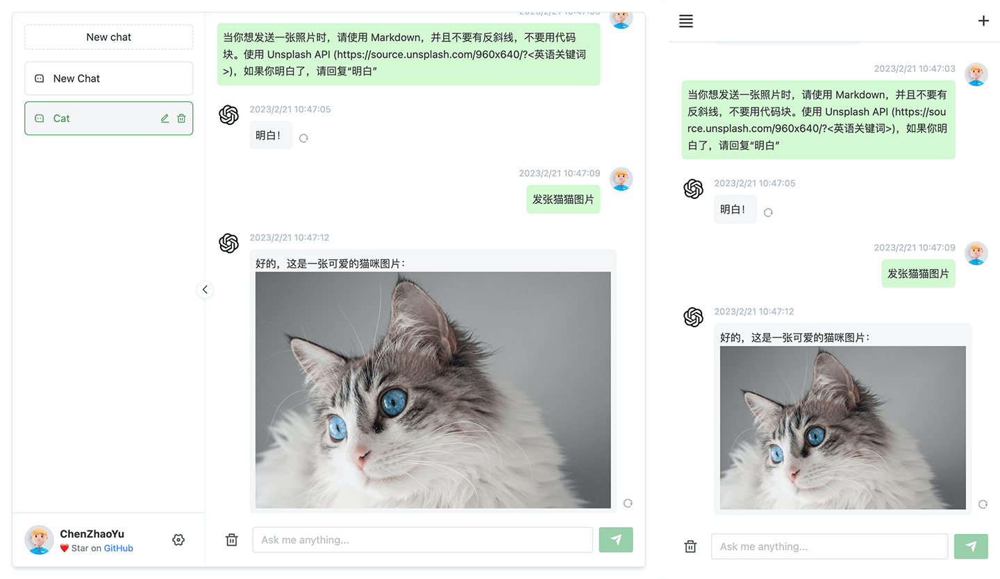

# ChatGPT Web

使用 `express` 和 `vue3` 搭建的支持 `ChatGPT` 双模型演示网页




## 介绍

支持双模型，提供了两种非官方 `ChatGPT API` 方法

|  方式   | 免费？  | 可靠性  | 质量 |
|  ----  | ----  | ----  | ----  |
| `ChatGPTAPI(GPT-3)`  | 否 | 	可靠 | 较笨 |
| `ChatGPTUnofficialProxyAPI(网页 accessToken)`  | 	是 |  不可靠 | 聪明 |

***Note:*** 网页 `accessToken` 存在大约 8 小时，而且国内地区网络问题更推荐使用 `GPT-3` 的方式

对比：
1. `ChatGPTAPI` 使用 `text-davinci-003` 通过官方`OpenAI`补全`API`模拟`ChatGPT`（最稳健的方法，但它不是免费的，并且没有使用针对聊天进行微调的模型）
2. `ChatGPTUnofficialProxyAPI` 使用非官方代理服务器访问 `ChatGPT` 的后端`API`，绕过`Cloudflare`（使用真实的的`ChatGPT`，非常轻量级，但依赖于第三方服务器，并且有速率限制）

切换方式：
1. 进入 `service/.env` 文件
2. 使用 `OpenAI API Key` 请填写 `OPENAI_API_KEY` 字段 [(获取 apiKey)](https://platform.openai.com/overview)
3. 使用 `Web API` 请填写 `OPENAI_ACCESS_TOKEN` 字段 [(获取 accessToken)](https://chat.openai.com/api/auth/session)
4. 同时存在时以 `OpenAI API Key` 优先

反向代理：

`ChatGPTUnofficialProxyAPI`时可用 [详情](https://github.com/transitive-bullshit/chatgpt-api#reverse-proxy)

```shell
# service/.env
API_REVERSE_PROXY=
```

## 待实现路线
[✓] 双模型

[✓] 多会话储存和上下文逻辑

[✓] 对代码等消息类型的格式化美化处理

[✗] 界面多语言

[✗] 界面主题

[✗] More...

## 前置要求

### Node

`node` 需要 `^16 || ^18` 版本（或者 `node >= 14` 需要安装 [fetch polyfill](https://github.com/developit/unfetch#usage-as-a-polyfill)），使用 [nvm](https://github.com/nvm-sh/nvm) 可管理本地多个 `node` 版本

```shell
node -v
```

### PNPM
如果你没有安装过 `pnpm`
```shell
npm install pnpm -g
```

### 填写密钥
获取 `Openai Api Key` 或 `accessToken` 并填写本地环境变量 [跳转](#介绍)

```
# service/.env 文件

# OpenAI API Key - https://platform.openai.com/overview
OPENAI_API_KEY=

# change this to an `accessToken` extracted from the ChatGPT site's `https://chat.openai.com/api/auth/session` response
OPENAI_ACCESS_TOKEN=
```

## 安装依赖

> 为了简便 `后端开发人员` 的了解负担，所以并没有采用前端 `workspace` 模式，而是分文件夹存放。如果只需要前端页面做二次开发，删除 `service` 文件夹即可。

### 后端服务

进入文件夹 `/service` 运行以下命令

```shell
pnpm install
```

### 网页
根目录下运行以下命令
```shell
pnpm bootstrap
```

## 测试环境运行
### 后端服务

进入文件夹 `/service` 运行以下命令

```shell
pnpm start
```

### 前端网页
根目录下运行以下命令
```shell
pnpm dev
```

## 打包

### 使用 Docker

### Docker 参数示例

- `OPENAI_API_KEY` 二选一
- `OPENAI_ACCESS_TOKEN`  二选一，同时存在时，`OPENAI_API_KEY` 优先
- `API_REVERSE_PROXY` 可选，设置 `OPENAI_ACCESS_TOKEN` 时可用 [参考](#介绍)
- `TIMEOUT_MS` 超时，单位毫秒，可选


### Docker build & Run

```bash
docker build -t chatgpt-web .

# 前台运行
docker run --name chatgpt-web --rm -it -p 3002:3002 --env OPENAI_API_KEY=your_api_key chatgpt-web

# 后台运行
docker run --name chatgpt-web -d -p 3002:3002 --env OPENAI_API_KEY=your_api_key chatgpt-web

# 运行地址
http://localhost:3002/
```

### Docker compose

[Hub 地址](https://hub.docker.com/repository/docker/chenzhaoyu94/chatgpt-web/general)

```yml
version: '3'

services:
  app:
    image: chenzhaoyu94/chatgpt-web:main
    ports:
      - 3002:3002
    environment:
      # 二选一
      OPENAI_API_KEY: xxxxxx
      # 二选一
      OPENAI_ACCESS_TOKEN: xxxxxx
      # 反向代理，可选
      API_REVERSE_PROXY: xxx
      # 超时，单位毫秒，可选
      TIMEOUT_MS: 60000
```


## 手动打包
### 后端服务
> 如果你不需要本项目的 `node` 接口，可以省略如下操作

复制 `service` 文件夹到你有 `node` 服务环境的服务器上。

```shell
# 安装
pnpm install

# 打包
pnpm build

# 运行
pnpm prod
```

PS: 不进行打包，直接在服务器上运行 `pnpm start` 也可

### 前端网页

1、修改根目录下 `.env` 内 `VITE_APP_API_BASE_URL` 为你的实际后端接口地址

2、根目录下运行以下命令，然后将 `dist` 文件夹内的文件复制到你网站服务的根目录下

[参考信息](https://cn.vitejs.dev/guide/static-deploy.html#building-the-app)

```shell
pnpm build
```

### 常见问题
Q: 为什么 `Git` 提交总是报错？

A: 因为有提交信息验证，请遵循 [Commit 指南](./CONTRIBUTING.md)

Q: 如果只使用前端页面，在哪里改请求接口？

A: 根目录下 `.env` 文件中的 `VITE_GLOB_API_URL` 字段。

Q: 文件保存时全部爆红?

A: `vscode` 请安装项目推荐插件，或手动安装 `Eslint` 插件。

## 参与贡献

贡献之前请先阅读 [贡献指南](./CONTRIBUTING.md)

感谢所有做过贡献的人!

<a href="https://github.com/Chanzhaoyu/chatgpt-web/graphs/contributors">
  
</a>

## License
MIT © [ChenZhaoYu](./license)
